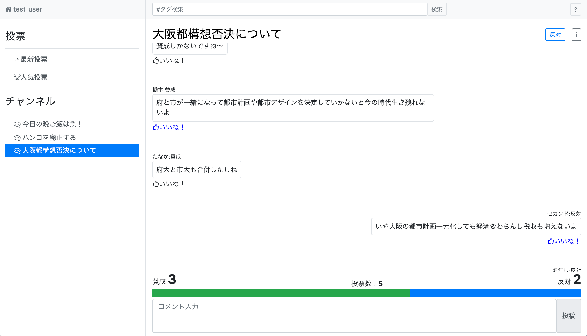
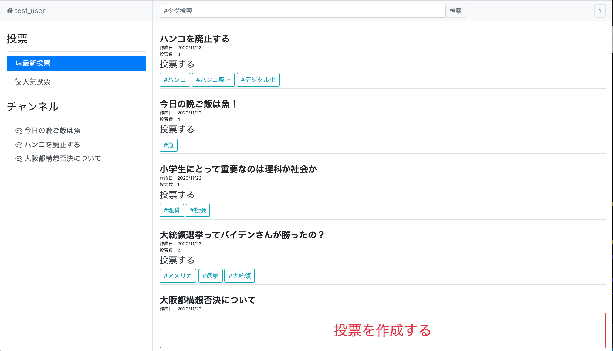
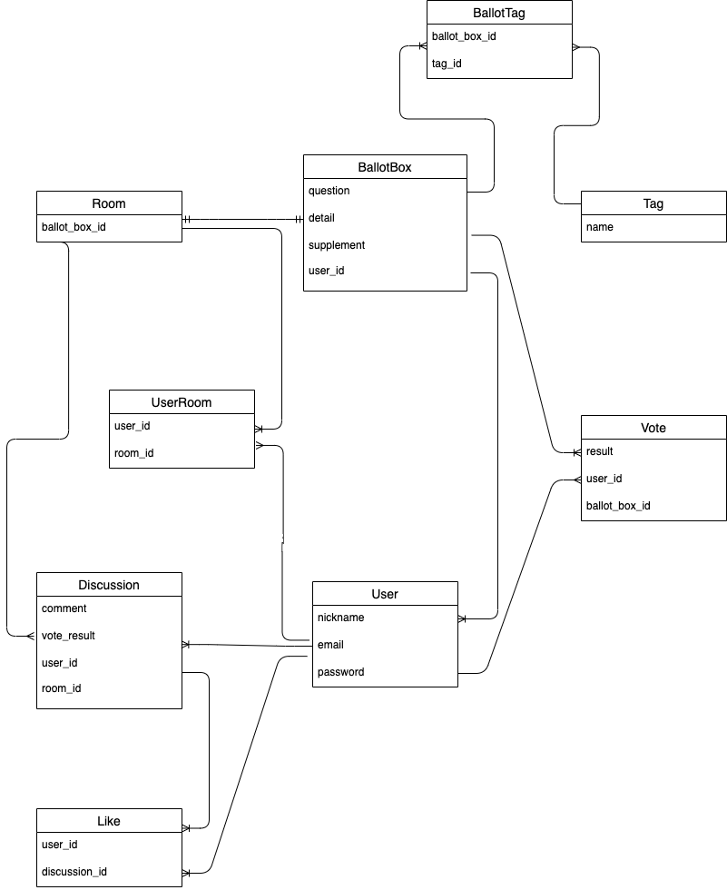

# 概要
## [Proscons](https://proscons.gq/)
※PC向けのサイト(スマートフォンでも閲覧可能)

"Proscons"という「投票型の掲示板サイト」です。 
"pros"は長所や賛成、"cons"は短所や反対の意味。

このサービスでは
- 賛成派・反対派のチーム制度
- 票の動きを可視化、変更も可能なフラットな投票制度

を用いることで、自分の考えを自信を持って主張できなかった人をサポートします。

◇ トップ右下からテストユーザーログインも可能ですので、自由にお試しください

# 使用技術
### フロントエンド
- HTML/CSS 
- JavaScript 
- React
- bootstrap4.5

### バックエンド
- Ruby on Rails6.0

### テスト
- Rspec
- Capybara

### データベース
- MySQL

### 本番環境
- AWS(EC2, route53, ACM)
- Nginx
- Unicorn
- Capistrano

### 開発環境
- Docker/Docker-compose(Nginx, Puma, MySQL)
- MacOS 
- VScode
- Git/GitHub

 

# 機能一覧
### ユーザー機能
- ユーザー登録
- テストユーザーログイン

### 投票箱作成機能
- 投稿(タイトル, 詳細, タグ(非同期))
- 編集(補足説明)
- 削除
- 一覧表示(最新, 人気)、詳細表示
- タグ検索(最新検索, 人気検索)

### 投票機能
- 投票(賛成・反対)
- 投票の変更

### チャンネル管理機能
- 参加、退出

### コメント機能
- 投稿(非同期)

### いいね機能
- コメントにいいね(非同期)
- いいねを削除(非同期)

### お問い合わせ機能
- slack(incoming webhooks)

### その他
- テスト(単体テスト・統合テスト, example:131)

# ER図

# サイト詳細

## URL
https://proscons.gq/

## 目的
私たちは日常的に大量の意思決定を行っています。その中でも自分以外の多数の人と意思決定をする機会にストレスを抱えることが多くあると感じました。 

[1. よくわからないまま、周りに流されてしまうこと]

[2. 他人を尊重するあまり自分の意見を言えない]

[3. 多数決によって自分の主張が通らない]

これらの背景から情報を文面として残すことでじっくり考えられる、２択の選択肢で気軽に意思表示ができる、さらに主張の質によって投票の重さが変わる場があればいいと思い制作に至りました。

## こだわり
- 賛成と反対を分けた非同期コミュニケーション
- いいねの獲得数に応じた投票数の変化
- 利用が直感的にわかるようなボタン配置、アイコンの使用
- GitHubにおけるPRやIssueの活用
- Commitやbranchに英語を使用

# About me
現在21歳。大阪の大学三回生ですが、休学してプログラミングを勉強しています。 
直近の目標としてインターンに参加するためのポートフォリオの作成・改善を行っています。